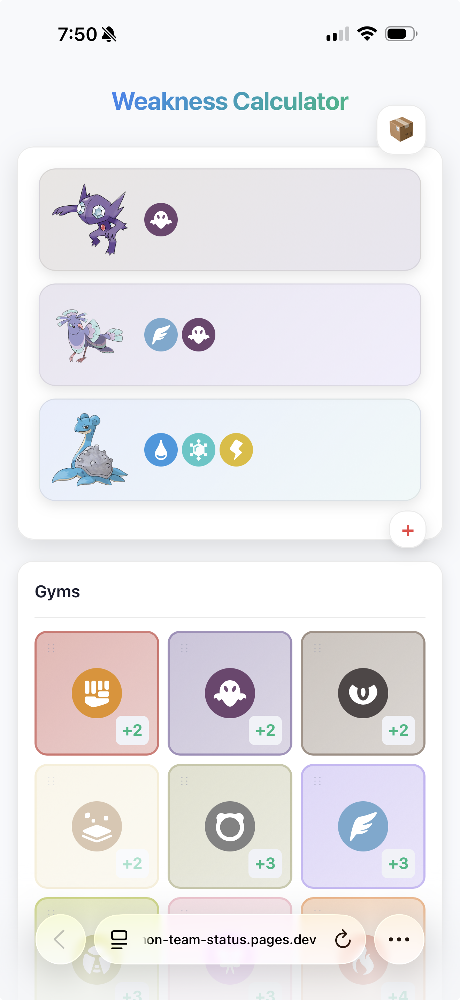

# Pokemon Team Weakness Calculator

A PWA for calculating team weaknesses against gym types. Built with Vue 3 + Vite. Optimized for Safari on iPhone.

Primarily designed for [Pokemon Emerald Rogue](https://www.pokecommunity.com/threads/pokemon-emerald-rogue.479406/) where gym types are randomized, but works for any Pokemon game.

**[Try it live](https://pokemon-team-status.pages.dev)**



## Quick Start

```bash
npm install
npm run dev
```

To run locally on your phone:

```bash
npx vite --host
```

## Documentation

- [How It Works](docs/how-it-works.md) - Scoring algorithm and Pokemon basics
- [Developer Guide](docs/developer-guide.md) - Architecture and contributing
- [Deployment](docs/deployment.md) - Cloudflare Pages setup and offline strategy

## Features

- Build a team of up to 6 Pokemon with reserve box
- See weakness/resistance scores against all 18 types
- Track defeated gyms
- Mega evolution support
- Works fully offline (PWA)

## Screenshots

See more screenshots in the [`screenshots/`](screenshots/) directory:
- Team building and Pokemon selection
- Ability, move, and berry configuration
- Gym weakness grid (mobile and desktop)
- Mega evolution and pin gym features

## Tech Stack

- Vue 3 + Vite
- Naive UI
- IndexedDB (offline storage)
- PWA with Workbox
