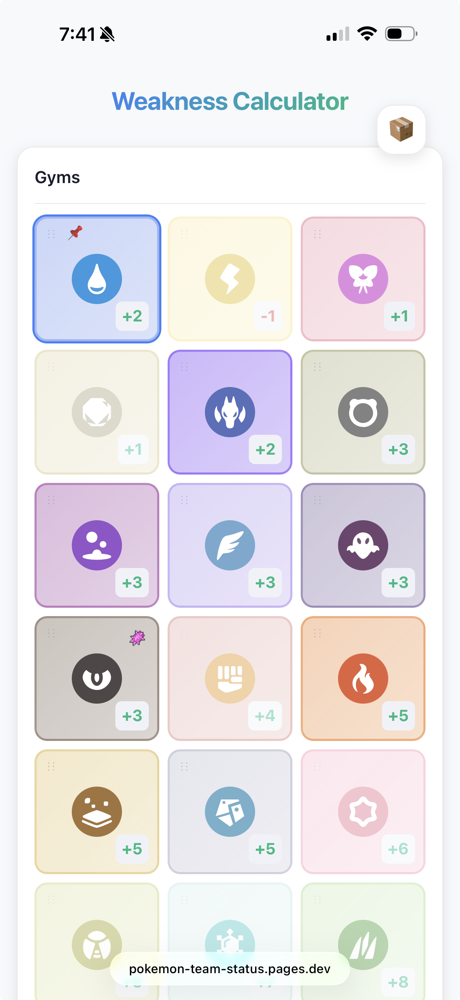
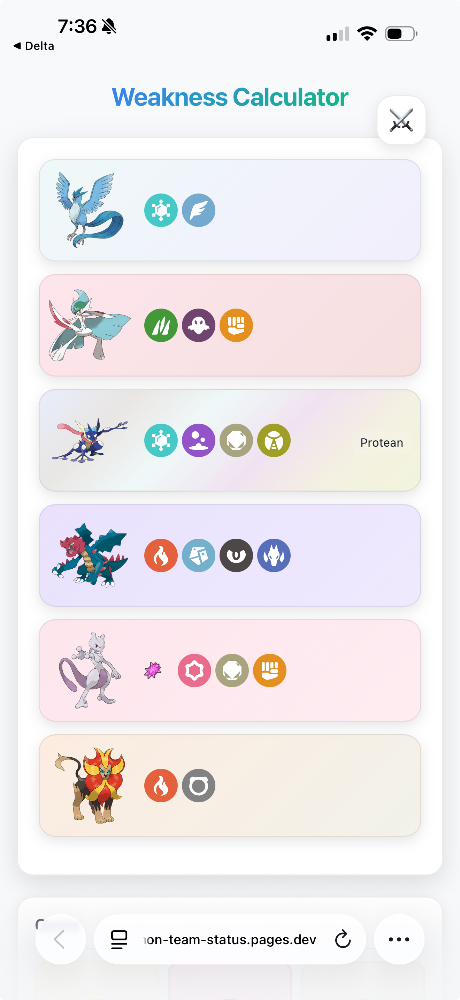
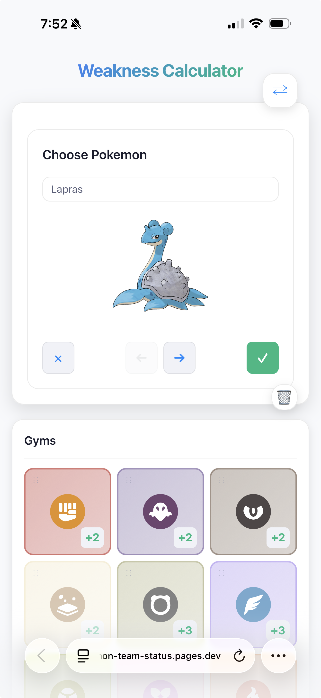

# Pokemon Team Weakness Calculator

A PWA for calculating team weaknesses against gym types. Built with Vue 3 +
Vite. Optimized for Safari on iPhone.

Primarily designed for [Pokemon Emerald Rogue][rogue] where gym types are
randomized, but works for any Pokemon game.

[rogue]: https://www.pokecommunity.com/threads/pokemon-emerald-rogue.479406/

**[Try it live](https://pokemon-team-status.pages.dev)**

| | |
| :---: | :---: |
|  |  |
|  |  |

## Quick Start

```bash
npm install
npm run dev
```

To run locally on your phone:

```bash
npx vite --host
```

### Supabase (Soul Link sync)

Copy `.env.example` to `.env.local` and fill in your Supabase project URL and
anon key. Without these, the app runs in local-only mode (no online sync).

## Documentation

- [How It Works](docs/how-it-works.md) - Scoring algorithm and Pokemon basics
- [Developer Guide](docs/developer-guide.md) - Architecture and contributing
- [Deployment](docs/deployment.md) - Cloudflare Pages setup and offline strategy

## Features

- Build a team of up to 6 Pokemon with reserve box
- See weakness/resistance scores against all 18 types
- Track defeated gyms
- Swap suggestions to optimize team coverage
- Mega evolution support
- **Soul Link mode**: Shared two-player runs with paired catches, real-time
  sync via Supabase, and invite code sharing
- Works fully offline (PWA)
  - **iOS**: Must be added to Home Screen for offline support

## Screenshots

More screenshots available in the [`screenshots/`](screenshots/) directory.

## Tech Stack

- Vue 3 + Vite
- Naive UI
- IndexedDB (offline storage)
- Supabase (Soul Link sync + Realtime)
- PWA with Workbox
